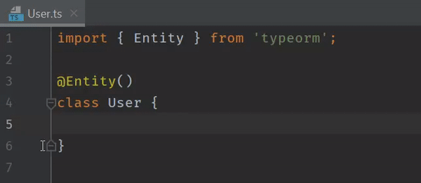

Reproduction repository for WebStorm TypeScript bug found in 2020.2 and previous EAPs:

```
WebStorm 2020.2
Build #WS-202.6397.88, built on July 24, 2020
Runtime version: 11.0.7+10-b944.20 amd64
VM: OpenJDK 64-Bit Server VM by JetBrains s.r.o.
Windows 10 10.0
GC: ParNew, ConcurrentMarkSweep
Memory: 2014M
Cores: 4
Registry: ide.balloon.shadow.size=0
Non-Bundled Plugins: com.wakatime.intellij.plugin, net.codestats.plugin.atom.intellij, com.almightyalpaca.intellij.plugins.discord, com.intellij.plugin.adernov.powershell, ru.adelf.idea.dotenv
```



#### Notes
- `tsconfig.json` is not required, but lack of `experimentalDecorators: true` causes warning to pop up
- Other affected modules include: `routing-controllers`
